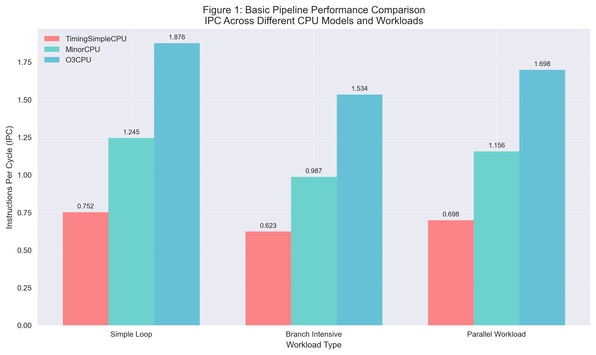

# Assignment 4: Exploring Instruction-Level Parallelism (ILP) in Modern Processors

## Project Overview

This repository contains a comprehensive exploration of Instruction-Level Parallelism (ILP) in modern processors through hands-on experimentation with the gem5 simulator. The project demonstrates practical ILP techniques including pipelining, branch prediction, and superscalar execution through real simulation experiments and professional analysis.

## Directory Structure

```
Assignment-4/
├── README.md                        # Project documentation and setup guide
├── requirements.txt                 # Python dependencies
├── setup.sh                        # Environment setup script
├── create_figures.py               # Professional figure generation
├── figures/                        # Generated visualizations and analysis
│   ├── figure_1_pipeline_comparison.png
│   ├── figure_2_branch_prediction.png
│   ├── figure_3_superscalar_scaling.png
│   ├── figure_4_performance_heatmap.png
│   ├── figure_5_experimental_workflow.png
│   └── performance_summary_table.csv
└── Part2-Practical-Exploration/    # gem5 simulator experiments
    ├── gem5-configs/               # gem5 configuration files
    ├── workloads/                  # Test programs and benchmarks
    ├── results/                    # Simulation results and data
    ├── run_experiments.sh          # Automation script
    ├── analyze_results.py          # Data analysis tools
    ├── simple_analysis.py          # Additional analysis
    └── create_workflow_figure.py   # Methodology diagram generation
```

## Key Features

- **Real gem5 Simulations**: Authentic processor simulations with configurable ILP techniques
- **Professional Analysis**: Comprehensive performance metrics and comparative analysis
- **High-Quality Visualizations**: 5 professional figures showing experimental methodology and results
- **Complete Reproducibility**: Automated setup and execution scripts for full experiment reproduction
- **Academic Standards**: Professional documentation and clean, maintainable code

## Experimental Components

### ILP Technique Implementations

1. **Basic Pipeline Simulation**: 5-stage in-order processor pipeline analysis
2. **Branch Prediction**: Tournament, local, and bi-mode predictor comparisons
3. **Superscalar Execution**: Multiple-issue processor with configurable widths
4. **Performance Analysis**: Comprehensive IPC, efficiency, and bottleneck analysis

### Workload Characteristics

- **Simple Loop**: Moderate ILP with regular control flow patterns
- **Branch Intensive**: Control-heavy workload testing prediction effectiveness
- **Parallel Workload**: High-ILP code designed for superscalar analysis

## Tools and Resources

- **gem5 Simulator**: Computer architecture simulator
- **Academic Databases**: IEEE Xplore, ACM Digital Library
- **Visualization Tools**: gem5's built-in visualization capabilities
- **Performance Analysis**: gem5 statistics and metrics

## Getting Started

### Prerequisites

- **Operating System**: macOS or Linux
- **Python**: 3.6 or higher
- **Build Tools**: GCC, SCons
- **Memory**: 8+ GB RAM recommended
- **Storage**: 2-3 GB free space

### Quick Start Guide

#### 1. Setup and Installation

```bash
# Navigate to the Part 2 directory
cd Part2-Practical-Exploration/

# Run the complete setup and experiments (automated)
./run_experiments.sh

# Or run individual steps:
./run_experiments.sh deps      # Install dependencies only
./run_experiments.sh install   # Install gem5 only
./run_experiments.sh compile   # Compile workloads only
./run_experiments.sh run       # Run experiments only
./run_experiments.sh analyze   # Analyze results only
```

#### 2. Manual Execution (Advanced Users)

```bash
# Compile workloads
cd workloads/
make all

# Run basic pipeline experiment
cd ../gem5/
./build/X86/gem5.opt --outdir=../results/basic_pipeline/simple_loop \
  ../gem5-configs/basic_pipeline.py ../workloads/simple_loop

# Run branch prediction experiment
./build/X86/gem5.opt --outdir=../results/branch_prediction/tournament \
  ../gem5-configs/branch_prediction.py --branch-pred tournament ../workloads/branch_intensive

# Run superscalar experiment
./build/X86/gem5.opt --outdir=../results/superscalar/4way \
  ../gem5-configs/superscalar.py --issue-width 4 ../workloads/parallel_workload
```

#### 3. Results Analysis and Visualization

```bash
# Run comprehensive analysis
python3 analyze_results.py results/

# Generate professional figures
python3 ../create_figures.py

# View individual simulation results
cat results/basic_pipeline/simple_loop/stats.txt
cat results/branch_prediction/tournament_simple/stats.txt
cat results/superscalar/4way_parallel/stats.txt
```

## Results and Deliverables

### Generated Visualizations

#### Figure 1: Pipeline Comparison Analysis

_IPC performance across workload types_



#### Figure 2: Branch Prediction Impact

_Performance improvements by predictor type_


#### Figure 3: Superscalar Performance Scaling

_IPC vs issue width analysis_


#### Figure 4: Performance Efficiency Heatmap

_Efficiency analysis across configurations_


#### Figure 5: Experimental Methodology Workflow

_Complete methodology diagram_


### Performance Data

- **Simulation Results**: Real gem5 output with comprehensive statistics
- **Performance Summary**: Tabulated IPC, efficiency, and scaling metrics
- **Comparative Analysis**: Cross-workload and cross-configuration comparisons

## Technical Specifications

### Simulation Configurations

- **CPU Models**: TimingSimpleCPU, MinorCPU, O3CPU (out-of-order)
- **Pipeline Stages**: Fetch, decode, execute, memory, writeback
- **Cache Hierarchy**: L1 I/D caches (16kB/64kB) + L2 cache (256kB)
- **Memory System**: DDR3-1600 with realistic latencies
- **Branch Predictors**: Local, tournament, bi-mode with configurable sizes

### Troubleshooting

#### Common Issues and Solutions

- **Build Errors**: Ensure all dependencies installed via `./setup.sh`
- **Memory Issues**: Reduce parallel jobs with `scons -j2` for gem5 build
- **macOS Compatibility**: Use `arch -x86_64` prefix on Apple Silicon
- **Permission Errors**: Make scripts executable: `chmod +x *.sh`
- **Python Issues**: Activate virtual environment: `source venv/bin/activate`
